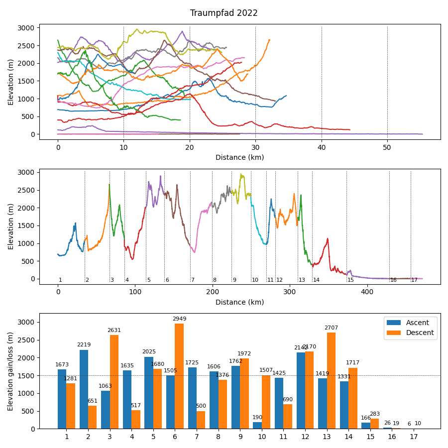

#### main.py

Main script to call other scripts. For example

* _format.py_
* _waypoints.py_
* _chart.py_

_test_ folder contains some example .gpx files

#### Format

> Usage `--format {input}`

Convert and clean gpx files. Supported input sites

* [traildino.com](https://www.traildino.com) use `--format traildino`
* [mapy.cz mobile app](https://en.mapy.cz/zakladni?mobilepromo=1) use `--format mapy`

Output is written to __output/output.gpx__

#### Chart

> Usage `--chart "path\to\inputfile" --title "chart title"`

Create graph of daily elevation of your gpx file, either as 3 subplots or as separate plots. \
In your input .gpx file:
* Each day or section should be in `<trk><\trk>` tags
* Each datapoint should be in format `<trkpt lat="47.760641" lon="11.573948"><ele>688.730469</ele></trkpt>`

(You can use the `gpx.py` script to convert your gpx file to the proper format)

